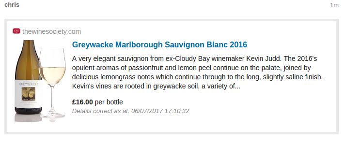

### thewinesociety-onebox

[Discourse](https://www.discourse.org) plugin to enable display of Oneboxed product page links from [The Wine Society's online shop](https://www.thewinesociety.com/buy-wine).

## Usage

Paste any product link from the online store, and it will be converted to a Onebox element during preview or after submission.

## Installation

Follow the [Install a Plugin](https://meta.discourse.org/t/install-a-plugin/19157) howto, using
`git clone https://github.com/chriskottom/thewinesociety-onebox.git` as the plugin command.

## License

MIT
